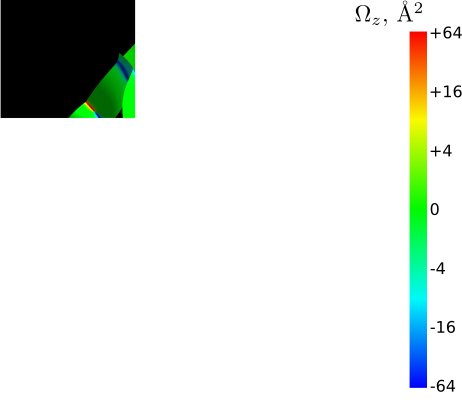

.. _sec-capabilities:

*********************
Capabilities  
*********************

Integration
-----------

The code may be used to evaluate the following quantities, represented
as Brillouin zone integrals (by means of the |integrate| function):

-  ``’ahc’ :`` intrinsic anomalous Hall conductivity
   :math:`\sigma_{\alpha\beta}^{\rm AHE}` (`Nagaosa et al. 2010 <https://journals.aps.org/rmp/abstract/10.1103/RevModPhys.82.1539>`_) via

   .. math:: \sigma_{\alpha\beta}^{\rm AHE}=-\frac{e^2}{\hbar}\epsilon_{\alpha\beta\gamma}\int \frac{d{\bf k}}{(2\pi)^3}\Omega_\gamma({\bf k}).

-  Anomalous Nernst conductivity (`Xiao et al. 2006 <https://doi.org/10.1103/PhysRevLett.97.026603>`_)
   :math:`\alpha_{\alpha\beta}^{\rm ANE}` may be obtained from
   :math:`\sigma_{\alpha\beta}(\epsilon)^{\rm AHE}` evaluated over a
   dense grid of Fermi levels :math:`\epsilon`

   .. math:: \alpha_{\alpha\beta}^{\rm ANE}=-\frac{1}{e}\int d\varepsilon \frac{\partial f}{\partial\varepsilon}\sigma_{\alpha\beta}(\varepsilon)\frac{\varepsilon-\mu}{T}, \label{eq:ANE}

   where
   :math:`f(\varepsilon)=1/\left(1+e^\frac{\varepsilon-\mu}{k_{\rm B}T}\right)`;

-  ``’Morb’`` : orbital magnetization (`Lopez et al. 2012 <https://doi.org/10.1103/PhysRevB.85.014435.>`_)

   .. math::

      M^\gamma_n({\bf k})=\frac{e}{2\hbar}{\rm Im\,}\epsilon_{\alpha\beta\gamma}\int[d{\bf k}]\sum_n^{\rm occ}\Bigl[
      \langle\partial_a u_{n{\bf k}}\vert H_{\bf k}+E_{n{\bf k}}-2E_F\vert\partial_b u_{n{\bf k}}\rangle\Bigr];

-  ``’berry_dipole’`` and ``’berry_dipole_fsurf’`` : berry curvature dipole

   .. math::

      D_{\alpha\beta}(\mu)=\int[d{\bf k}]\sum_n^{\rm occ} \partial_\alpha \Omega_n^{\beta}= \int[d{\bf k}]\sum_n^{\rm occ} \partial_\alpha E_{n\mathbf{k}} \Omega_n^{\beta} \delta(E_{n\mathbf{k}}-\mu) 

   which describes nonlinear Hall effect (`Sodemann and Fu 2015 <https://link.aps.org/doi/10.1103/PhysRevLett.115.216806>`_);

-  ``’gyrotropic_Korb’`` and ``gyrotropic_Kspin :`` gyrotropic
   magnetoelectric effect (GME) (`Zhong, Moore, and Souza 2016 <https://link.aps.org/doi/10.1103/PhysRevLett.116.077201>`_) tensor
   (orbital and spin contributions) in the Fermi-sea formulation:

   .. math:: K_{\alpha\beta}(\mu)=\int[d{\bf k}]\sum_n^{\rm occ}  \partial_\alpha m_n^{\beta} ; \label{eq:gyro-K}

-  ``’gyrotropic_Korb_fsurf’`` and ``gyrotropic_Kspin_fsurf`` :  gyrotropic
   magnetoelectric effect (GME) (`Zhong, Moore, and Souza 2016 <https://link.aps.org/doi/10.1103/PhysRevLett.116.077201>`_) tensor
   (orbital and spin contributions) in the Fermi-surface formulation:

   .. math:: 

      K_{\alpha\beta}(\mu)=\int[d{\bf k}]\sum_n^{\rm occ}  \partial_\alpha E_{n\mathbf{k}} m_n^{\beta} \delta (E_{n{\bf k}}-\mu) 

-  ``’conductivity_Ohmic’`` and  ``’conductivity_Ohmic_fsurf’`` ohmic conductivity within the Boltzmann
   transport theory in constant relaxation time (:math:`\tau`) 
   - Femi-sea and Fermi-surface formula approximation:

   .. math::

      \sigma_{\alpha\beta}^{\rm Ohm}(\mu)
      =\tau\int[d{\bf k}]\sum_n^{E_{n{\bf k}}<\mu} \partial^2_{\alpha\beta} E_{n{\bf k}}
      =\tau\int[d{\bf k}]\sum_n^{\rm occ} \partial_\alpha E_{n{\bf k}}\partial_\beta E_{n{\bf k}} \delta(E_{n{\bf k}}-\mu) 
            ; \label{eq:ohmic}

-  'opt_conductivity': Kubo-greenwood formula for optical conductivity (:ref:`example <sec-optconf-example>`)
  
   .. math:: 
      :label: optcondform

      \sigma_{\alpha\beta}(\hbar\omega)=\frac{ie^2\hbar}{N_k\Omega_c}
      \sum_{\bf k}\sum_{n,m}
      \frac{f_{m{\bf k}}-f_{n{\bf k}}}
      {\varepsilon_{m{\bf k}}-\varepsilon_{n{\bf k}}}
      \frac{\langle\psi_{n{\bf k}}\vert v_\alpha\vert\psi_{m{\bf k}}\rangle
      \langle\psi_{m{\bf k}}\vert v_\beta\vert\psi_{n{\bf k}}\rangle}
      {\varepsilon_{m{\bf k}}-\varepsilon_{n{\bf k}}-(\hbar\omega+i\eta)}.

-  ``’dos’ :`` density of states :math:`n(E)`;

-  ``’cumdos’ :`` cumulative density of states

   .. math::

      N(E) = \int\limits_{-\infty}^En(\epsilon)d\epsilon.
          \label{eq:cDOS}

Tabulating
----------

.. _figFefrmsf:

   Fermi surface of bcc iron, colored by the Berry curvature
   :math:`\Omega_z`. Figure produced using `FermiSurfer <https://fermisurfer.osdn.jp/>`_.

``WannerBerri`` can also tabulate certain band-resolved quantities over the
Brillouin zone. This feature is called with |tabulate| function, e.g.

.. code:: python

   WB.tabulate(system, grid,
                quantities=["berry"],
                fout_name="Fe",
                numproc=16,
                ibands=np.arange(4,10),
                Ef0=12.610)

which will produce files ``Fe_berry-?.frmsf``, containing the Energies
and Berry curvature of bands ``4-9`` (band counting starts from zero).
The format of the files allows to be directly passed to the
``FermiSurfer`` visualization tool (Kawamura 2019) which can produce a
plot like :numref:`figFefrmsf`. Transformation of files to other
visualization software is straightforward.

Currently the following quantities are available to tabulate:

-  ``’berry’ :`` Berry curvature

   .. math:: \Omega^\gamma_n({\bf k})=-\epsilon_{\alpha\beta\gamma}{\rm Im\,}\langle\partial_\alpha u_{n{\bf k}}\vert\partial_\beta u_{n{\bf k}}\rangle;

-  ``’morb’ :`` orbital moment of Bloch states

   .. math:: m^\gamma_n({\bf k})=\frac{e}{2\hbar}\epsilon_{\alpha\beta\gamma}{\rm Im\,}\langle\partial_\alpha u_{n{\bf k}}\vert H_{\bf k}-E_{n{\bf k}}\vert\partial_\beta u_{n{\bf k}}\rangle;

-  ``’spin’ :`` the expectation value of the Pauli operator

   .. math:: \mathbf{s}_n({\bf k})=\langle u_{n{\bf k}}\vert\hat{\bf \sigma}\vert u_{n{\bf k}}\rangle;

-  ``’V’ :`` the band gradients :math:`\nabla_{\bf k}E_{n{\bf k}}`.

Evaluation of additional matrix elements 
-----------------------------------------

In order to produce the matrix elements that are not evaluated by a particular *ab initio* code, the following interfaces
have been developed:

mmn2uHu 
++++++++++++++++++

The |mmn2uHu| module evaluates the (``.uHu`` file) containing the matrix elements needed for orbital moment calculations

.. math::

    C_{mn}^{\mathbf{b}_1,\mathbf{b}_2}({\bf q})=\langle u_{m{\bf q}+\mathbf{b}_1}\vert\hat{H}_{\bf q}\vert u_{n{\bf q}+\mathbf{b}_2}\rangle.

on the basis of the ``.mmn`` and ``.eig`` files by means of the sum-over-states formula

.. math::

    C_{mn}^{\mathbf{b}_1,\mathbf{b}_2}({\bf q})\approx\sum_l^{l_{\rm max}}  \left(M_{lm}^{\mathbf{b}_1}({\bf q})\right)^* E_{l{\bf q}}   M_{ln}^{\mathbf{b}_2}({\bf q}).

see :ref:`sec-mmn2uHu` for more details

vaspspn 
+++++++

The |vaspspn| computes the spin matrix

.. math:: s_{mn}({\bf q})=\langle u_{m{\bf q}}\vert\hat{\sigma}\vert u_{n{\bf q}}\rangle

based on the normalized pseudo-wavefunction read from the ``WAVECAR`` file written by 
`VASP <https://www.vasp.at/>`_

see :ref:`sec-vaspspn` for more details

The |mmn2uHu| and |vaspspn| modules were initially developed and
used in (`Tsirkin, Puente, and Souza 2018 <https://journals.aps.org/prb/abstract/10.1103/PhysRevB.97.035158>`_) as separate scripts, but were
not published so far. Now they are included in the ``WannierBerri``
package with a hope of being useful for the community.

.. include:: shortcuts.rst