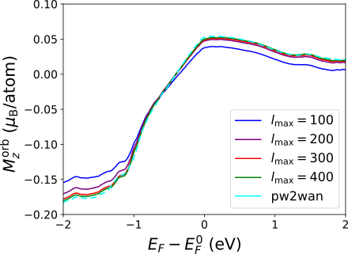

**************************
Documentation 
**************************

.. automodule:: wannierberri
   :no-members:
   :noindex:

.. autofunction:: print_options

Integrating
===============

.. autofunction:: integrate

Tabulating
===============

.. autofunction:: tabulate

.. autoclass:: TABresult
   :members: fermiSurfer, get_data
   :undoc-members:
   :show-inheritance:

Creating a grid
===============

.. autoclass:: Grid

Initializing a System
======================

The first step in the ``wannierberri`` calculation is initialising the System.  This is done by means of child classes :class:`~wannierberri.__system.System` described below. 
They all have an important common method :func:`~wannierberri.System.set_symmetry`. 
The system may come either from :ref:`Wanier functions <sec-wan-fun>`  constructed by `Wannier90 <http://wannier90.org>`_, or from ref:`tight binding <sec-tb-models>` models. 

.. autoclass:: wannierberri.System
   :members: set_parameters , set_symmetry
   :undoc-members:
   :show-inheritance:

.. _sec-wan-fun:

From Wannier functions
----------------------

.. autoclass:: System_w90
   :show-inheritance:

.. _sec-tb-models:

From tight-binding models 
----------------------------------

``wannier90_tb.dat`` file
+++++++++++++++++++++++++

.. autoclass:: System_tb
   :show-inheritance:

PythTB
+++++++++

.. autoclass:: System_PythTB
   :show-inheritance:

TBmodels
+++++++++

.. autoclass:: System_TBmodels
   :show-inheritance:

----

Symmetries
======================

.. automodule:: wannierberri.symmetry
   :members: Rotation,Mirror
   :undoc-members:
   :show-inheritance:

.. autoclass:: wannierberri.symmetry.Group
   :members: get_symmetric_components, gen_symmetric_tensor, check_basis_symmetry
   :undoc-members:
   :show-inheritance:

----

.. _sec-mmn2uHu:

mmn2uHu
==========

Wannier interpolation starts from certain matrix elements defined on the
*ab initio* (:math:`{\bf q}`) grid. Those matrix elements should be
evaluated within the *ab initio* code, namely within its interface to
Wannier90. However, only `QuantumEspresso <https://www.quantum-espresso.org/>`_ has the
most complete interface ``pw2wannier90.x``. The other codes provide only
the basic interface, which includes the eigenenergies
:math:`E_{n{\bf q}}` (``.eig`` file) and overlaps

.. math:: M_{mn}^{\mathbf{b}}({\bf q})=\langle u_{m{\bf q}}\vert u_{n{\bf q}+\mathbf{b}}\rangle

(file ``.mmn``), where :math:`\mathbf{b}` vector connects neighbouring
:math:`{\bf q}`-points. This information allows to interpolate the band
energies (and their derivatives of any order) as well as Berry
connections (`Yates et al. 2007 <https://doi.org/10.1103/PhysRevB.75.195121>`_) and Berry curvature (`Wang et al. 2006 <https://doi.org/10.1103/PhysRevB.74.195118.>`_).
However, to evaluate the orbital moment of a Bloch state, one needs
matrix elements of the Hamiltonian (`Lopez et al. 2012 <https://doi.org/10.1103/PhysRevB.85.014435.>`_) (``.uHu`` file)

.. math::
    :label: Cmnq

    C_{mn}^{\mathbf{b}_1,\mathbf{b}_2}({\bf q})=\langle u_{m{\bf q}+\mathbf{b}_1}\vert\hat{H}_{\bf q}\vert u_{n{\bf q}+\mathbf{b}_2}\rangle.

The evaluation of :eq:`Cmnq` is very specific to the
details of the *ab initio* code, and implemented only in
``pw2wannier90.x`` and only for norm-conserving pseudopotentials. To
enable the study of properties related to the orbital moment with other
*ab initio* codes, the following workaround may be employed. By
inserting a complete set of Bloch states at a particular :math:`{\bf q}`
point
:math:`\mathbbm{1}=\sum_l^\infty \vert u_{l{\bf q}}\rangle\langle u_{l{\bf q}}\vert`
we can rewrite :eq:`Cmnq` as

.. math::
    :label: Cmnqsum

    C_{mn}^{\mathbf{b}_1,\mathbf{b}_2}({\bf q})\approx\sum_l^{l_{\rm max}}  \left(M_{lm}^{\mathbf{b}_1}({\bf q})\right)^* E_{l{\bf q}}   M_{ln}^{\mathbf{b}_2}({\bf q}).

This equation is implemented within the |mmn2uHu|
submodule, which allows to generate the ``.uHu`` file out of ``.mmn``
and ``.eig`` files. The equality in :eq:`Cmnqsum` is
exact only in the limit :math:`l_{\rm max}\to\infty` and infinitely
large basis set for the wavefunctions representation. So in practice one
has to check convergence for a particular system. As an example the
bandstructure of bcc Fe was calculated based on the QE code and a
norm-sonserving pseudopotential from the PseudoDojo library(van Setten
et al. 2018; Hamann 2013). Next, the orbital magnetization was
calculated using the ``.uHu`` file computed with ``pw2wannier90.x`` and
using the |mmn2uHu| interface with different summation
limit :math:`l_{\rm max}` in :eq:`Cmnqsum`. As can be
seen in :numref:`figmmn2uHu` already :math:`l_{\rm max}=200`
(corresponding energy :math:`\sim 230` eV) yields a result very close to
that of ``pw2wannier90.x``. However one should bear in mind that
convergence depends on many factors, such as as choice of WFs and
pseudopotentials. In particular, for tellurium we observed (Tsirkin,
Puente, and Souza 2018) that including only a few bands above the
highest :math:`p`-band is enough to obtain accurate results. However for
iron, using a pseudopotential shipped with the examples of Wannier90, we
failed to reach convergence even with :math:`l_{\rm max}=600`.

.. _figmmn2uHu:

   Orbital magntization of bcc Fe as a function of the Fermi level
   :math:`E_F` reative to the pristine Fermi level :math:`E_F^0`,
   evaluated using the ``.uHu`` file computed with ``pw2wannier90.x``
   (dashed line) and using the |mmn2uHu| interface (solid
   lines) with different summation limit :math:`l_{\rm max}` in
   :eq:`Cmnqsum` 

.. automodule:: wannierberri.mmn2uHu
   :members:
   :no-undoc-members:
   :show-inheritance:

.. _sec-vaspspn:

vaspspn
======================

To interpolate the spin operator expectation value, the matrix
:math:`s_{mn}({\bf q})=\langle u_{m{\bf q}}\vert\hat{\sigma}\vert u_{n{\bf q}}\rangle`
is needed. To facilitate study of spin-dependent properties within `VASP <https://www.vasp.at/>`_
code, a submodule |vaspspn| is
included, which computes :math:`S_{mn{\bf q}}` based on the normalized
pseudo-wavefunction read from the ``WAVECAR`` file. Note that the use of
pseudo-wavefunction instead of the full PAW (`Blöchl 1994 <https://journals.aps.org/prb/abstract/10.1103/PhysRevB.50.17953>`_) wavefunction
is an approximation, which however in practice gives a rather accurate
interpolation of spin.

.. automodule:: wannierberri.vaspspn
   :members:
   :no-undoc-members:
   :show-inheritance:

Plotting lines and planes (tab_plot)
=====================================

.. automodule:: wannierberri.tab_plot
   :members:
   :no-undoc-members:
   :show-inheritance:

.. include:: shortcuts.rst