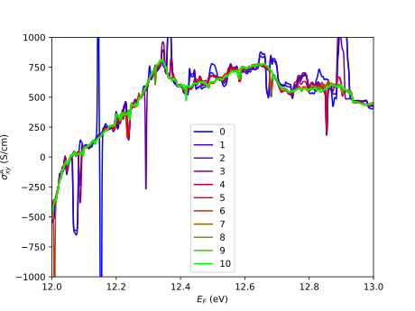

.. _sec-example:

Examples: 
====================================

AHC of bcc Fe
---------------

First let’s consider a simple example - we will calculate a anomalous
Hall conductivity of bcc iron, and also visualize the Berry curvature
over the Fermi surface. This is equivalent to example18 of Wannier90.

We assume that we have performed the ab-initio calculations and
constructed the MLWFs for bcc iron with magnetization along [001]
direction (:math:`z`). For information how to do it, please refer to the
manuals of the abinitio codes and Wannier90. Also a nicely ilustrated tutorial is published
on the `WanierToools <https://www.wanniertools.org/tutorials/high-quality-wfs/>`_ website.

After that, the calculation is performed by the following short python
script. First, we import the needed packages

.. code:: python

   import wannierberri as wberri
   import numpy as np

Then we read the information about the system. Either we read the
information abot Wanier functions:

.. code:: python

   system=wberri.System_w90('Fe',berry=True)

thie reads the files ``’Fe.chk’``, ``’Fe.eig’``, ``’Fe.mmn’``. [6]_
Alternatively, we can read all information from a file ``Fe_tb.dat``,
which is also written by Wannier90, or maybe composed by user from any
tight-binding model. This can be done by the following line:

.. code:: python

   system=wberri.System_tb('Fe_tb.dat',getAA=True)

Next, we define the symmetries of the system that we wish to take into
account:

.. code:: python

   generators = ['Inversion','C4z','TimeReversal*C2x']
   system.set_symmetry(generators)

In the ab initio calculation we have specified the magnetization along
the :math:`z` axis, hence the symmetries that are preserved are
inversion :math:`\cal I`, 4-fold rotation around the :math:`z` axis
:math:`C_{4z}`,and a combination of time-reversal :math:`\cal T` and
2-fold rotation around the :math:`x` axis :math:`C_{2x}`. Here we need
only the generators of the symmetry group. The other symmetries will be
automatically obtained by taking products of these generators. E.g. the
mirror :math:`M_z=(C_{4z})^2\cdot \cal I`. Next we need to set the
:math:`{\bf k}`-point grid. Most conveniently it can be done by setting
the ``’length’`` parameter.

.. code:: python

   grid=wberri.Grid(system,length=100)

This will guarantee the grid to be consistent with the symmetries, and
the spacing of :math:`k`-points will be
:math:`\Delta k\approx \frac{2\pi}{\rm length}`. In this particular case
a grid of :math:`52\times52\times52` will be generated, but that
is dependent on the size of the unit cell.

Next, we want to integrate the Berry curvature to get the AHC. This is
done by the ``wberri.integrate`` method.

.. code:: python

   wberri.integrate(system, grid, 
               Efermi=np.linspace(12.,13.,1001), 
               smearEf=10, # 10K
               quantities=["ahc","dos","cumdos"],
               numproc=16,
               adpt_num_iter=10,
               fout_name="Fe")

and in addition to AHC we evaluate the density of states (DOS) and
cumulative DOS. We consider Fermi level as a free parameter, and we scan
over a set of Fermi levels from 12 to 13 eV with a step of 1 meV. To
avoid too strong jittering of the curve, we introduce a small smearing
over the Fermi level corresponding to temperature 10K (:math:`\sim1`
meV). It is known, that in BZ integrations, some :math:`{\bf k}` points
give huge spites in the :math:`E_F`-resolved curves. This is especially
strong for Berry curvature, which diverges near band degeneracies and
avoided crossings, that fall close to the Fermi level. To make the
calculation more precise around those points, and adaptive recursive
refinement algorithm is used, and we set the number of iterations to
10 [7]_. The integration is done in parallel by means of the
``multiprocessing`` module and the parameter ``’numproc’`` specifies
that a ``Pool`` of 16 worker processes is used. Both the smeared and
unsmeared result is written to the files, e.g. ``Fe-???_iter-????.dat``.
In particular, from the cumulative dos (``Fe-cumdos_iter-????.dat``) we
can find the precise position of the Fermi level :math:`E_F=12.610` eV —
the energy at which the cumulative DOS reaches 8 electrons per unit
cell. This is much more accurate, then the result of the ``postw90.x`` which
is evaluated from a coarse abinitio grid.

Next, it is instructive to plot the AHC after each iteration
(:numref:`figFeahc`). One can see that already after a few
iterations most of the chaotic peaks are removed, and we can get a
reasonably sooth curve already starting from a not very dense grid.

.. _figFeahc:

   AHC of bcc iron after each refinement iteration

Tabulating Berry curvature
---------------------------

Now we wish to visualize the Berry curvature to see, from which parts of
the BZ mostly contribute for the AHC. For that purpose we employ the
following method:

.. code:: python

   wberri.tabulate(system, grid,
                quantities=["berry"],
                fout_name="Fe",
                numproc=16,
                ibands=np.arange(4,10),
                Ef0=12.6)

Which produce files ``Fe_berry-x.frmsf``, ``Fe_berry-y.frmsf``,
``Fe_berry-z.frmsf``, containing the Energies and Berry curvature of
bands ``4,5,6,7,8,9``\  [8]_ over. The format is chosen such that the
files can be directly passed to the ``FermiSurfer`` |fsurf| visualization
tool(“Fermisurfer Visualization Tool,” n.d.; Kawamura 2019) [9]_
However, the hotspots of Berry curvature usually present tiny areas with
huge magnitude of :math:`{\cal O}`. Hence to get a smoother picture we
apply a logarithmic scale as

.. math::

   f(x)={\rm sign}(x)\ln(1+|x|/x_0)
   \label{eq:logscale}

with :math:`x_0=1` ???. Now we can use the ``FermiSurfer`` to produce
:numref:`figFefrmsf`

This short example demonstrates that that the calculations with
``WannierBerri``\ may be run in a few lines.
Appendix. `[sec:capabilities] <#sec:capabilities>`__ describes all
options available to integrate and tabulate for the moment. Fore options
are under development or under testing. For more information on all
available parameters, please read the docstrings of the corresponding
methods, which are accessible with the python built-in ``help()``
function.

.. _sec-optconf-example:

Optical conductivity
--------------------

The Kubo formula :eq:`optcondform` for the (interband) optical conductivity may be evaluated by adding 'opt_conductivity' 
to the list of quantities to integrate, for more details see the example below.

The implementation is based on the one in postw90. Thus, with identical input and equivalent parameters, 
it reproduces the results from postw90. Note, however, that when using the full power of wannier-berri (symmetries, adaptive refinement etc.) 
small deviations are to be expected. Please refer to :ref:`sec-benchmark`.

In contrast to the other quantities currently implemented, this is an optical quantity and therefore requires a list of frequencies rather than a list of Fermi energies; the relevant argument name for wberri.integrate() is omega and its values are expected to be in eV. Additionally, there are several options (following the usual syntax of wannier-berri) that can be specified:

 - **'mu'** : chemical potential in units of eV
 - **'kBT'** : temperature in units of eV/kB (can also be 0)
 - **'smr_fixed_width'** : fixed smearing parameter in units of eV
 - **'smr_type'** : analytical form of the broadened delta function (must be one of 'Lorentzian' or 'Gaussian')

Here smearing refers to the approximation of the delta function in the Kubo formula.

An example call might look as follows (with appropriate initialization):

.. code:: python

   wberri.integrate(system,
           grid = grid,
           omega = np.linspace(0., 7., 701),
           smearEf = 10,
           quantities = [ 'opt_conductivity' ],
           numproc = num_proc,
           adpt_num_iter = 10,
           fout_name = 'Fe',
           restart = False,
           parameters = { 'mu': 12.6283, 'smr_fixed_width': 0.01, 'smr_type':'Gaussian' }
   )

.. |fsurf| image:: https://fermisurfer.osdn.jp/figs/fermisurfer.png
     :target: https://fermisurfer.osdn.jp/
     :alt: FermiSurfer
     :height: 30px 

.. [6]
   the first is written by Wannier90, the other two by the interface of
   the ab initio code (e.g. pw2wannier90.x)

.. [7]
   see Sec. :ref:`sec-refine`

.. [8]
   counting starts from zero

.. [9]
   For description of the format please refer to (`Kawamura 2019 <https://www.sciencedirect.com/science/article/pii/S0010465519300347?via%3Dihub>`). This
   format is an arbitrary choice, and by means of simple manipulations
   the file may be transformed to be used by ant other visualization
   software.
