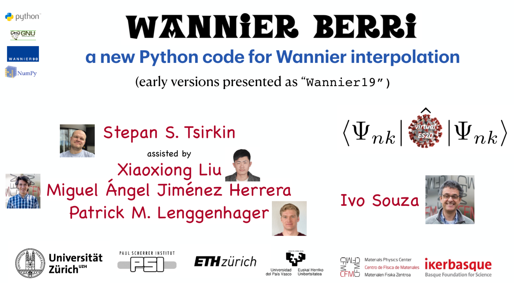

.. Wannier Berri documentation master file, created by
   sphinx-quickstart on Tue Jul  7 23:40:59 2020.
   You can adapt this file completely to your liking, but it should at least
   contain the root `toctree` directive.

.. title:: Wannier Berri

.. image:: imag/logo-WB/WANNIERBERRI-line-redblack.png
    :width: 700px
    :alt: Wannier Berri
    :align: center

|

is a code to calculate different properties by means of Wannier interpolation. 
It may be considered as a strongly improved version of ``postw90.x`` part of `Wannier90 <https://wannier.org>`_.  

#############
Advantages
#############

    *  **speed**  - it may be upto **1000 or more times faster** then ``postw90.x`` : :ref:`comparison  <sec-timing>`

    *  **extensive functionality** -- see :ref:`sec-capabilities`

    *  **felxibility** -- may be used with Wannier functions and tight-binding models

    *  use of  :ref:`symmetries <sec-symmetry>`  to reduce evaluation to symmetry-irreducible **k** points.

    *  :ref:`fast Fourier transform  <sec-FFT>`  

    *  Recursive adaptive :ref:`refinement   <sec-adaptive>` for enhanced accuracy.

    *  :ref:`Fermi scan <sec-fermisea>`  and :ref:`minimal distance replica selection  <sec-replica>` have no cost

#############
Please cite
#############

    *   Destraz, Daniel, Lakshmi Das, Stepan S. Tsirkin, Yang Xu, Titus Neupert, J. Chang, A. Schilling, et al. 2020. “Magnetism and
        Anomalous Transport in the Weyl Semimetal Pralge: Possible Route
        to Axial Gauge Fields.” *Npj Quantum Materials* 5 (1): 5.
        `DOI <https://doi.org/10.1038/s41535-019-0207-7>`_.

    *   Stepan S. Tsirkin. "High performance Wannier interpolation of Berry curvature and related quantities: WannierBerri code",   `arXiv:2008.07992 [cond-mat.mtrl-sci] <https://arxiv.org/abs/2008.07992>`_

#########################################################
Presentation 
#########################################################

   From Tutorial at *Virtual Electronic Structure Workshop* |ESW2020|

   *  `Video <https://uzh.zoom.us/rec/share/y84qFIzs8WlIY53g-UGYdfUCB6DUaaa80SUZ-fJZy-GyE37OpaVGSfwDqVj43hk>`_ 

   *  `Slides <http://slides.wannier-berri.org>`_ (updated)

.. |ESW2020| image:: https://physics.ucmerced.edu/sites/physics.ucmerced.edu/files/page/images/virtual_es20_0.png
   :height: 30px
   :target: https://physics.ucmerced.edu/electronic-structure-workshop
   :alt: Virtual Electronic Structure Workshop Merced

##############
Contact:
##############

    *    Subscribe to `mailing list <https://physik.lists.uzh.ch/sympa/info/wannier-berri>`_.
    *    contact author: `stepan.tsirkin@uzh.ch <mailto:stepan.tsirkin@uzh.ch>`_
    *    GitHub repository: `<https://github.com/stepan-tsirkin/wannier-berri>`_
    *    |twitter-button|
    
.. |twitter-button| raw:: html

   <a href="https://twitter.com/WannierBerri?ref_src=twsrc%5Etfw" class="twitter-follow-button" data-show-count="false">Follow @WannierBerri</a>

################################################################################################################
Install  via ``pip``  (`PyPI <https://pypi.org/project/wannierberri>`_):
################################################################################################################
::

   pip3 install wannierberri

.. toctree:: 
   :maxdepth: 3
   :hidden:

   news
   capabilities
   timing
   exampleFe
   documentation
   methods
   install
   people
   organizations
   contribute
   software
   literature

