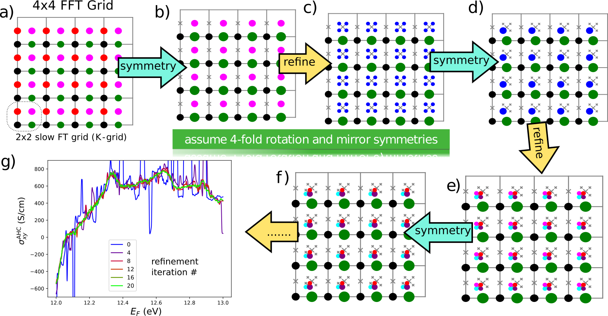

*********************
Methods 
*********************

General equations for Wannier interpolation
=======================================================

The goal of this section is to introduce notation necessary for further
discussion.

In a general case of entangled bands one can define a set of :math:`J`
wannier functions defined as

.. math:: \vert{\bf R}n\rangle=\frac{V}{(2\pi)^3}\int_{\rm BZ} d{\bf k}e^{-i{\bf k}{\bf R}} \sum_{m=1}^{{\cal J}_{\bf k}} V_{mn}({\bf k})\vert\psi_{m{\bf k}}\rangle

where :math:`{\cal J}_{\bf k}\ge J` and
:math:`\sum_m^{{\cal J}_{\bf k}} V^*_{mn}({\bf k})V_{mn'}({\bf k})=\delta_{nn'}`.
The matrices :math:`V_{mn'}({\bf k})` convert :math:`{\cal J}_{\bf k}`
ab initio wavefunctions into :math:`J` Wannier functions. They are
chosen in such a way that the Wannier functions are localized, which
yields that the wavefunctions in the Wannier gauge

.. math:: \vert\psi_{n{\bf k}}^{\rm W}\rangle \equiv e^{i{\bf k}\cdot{\bf r}}\vert u_{n{\bf k}}^{\rm W}\rangle\equiv  \sum_{{\bf R}}e^{i{\bf k}\cdot{\bf R}}\vert{\bf R}n\rangle  \label{eq:psiW}

are smooth functions of the :math:`{\bf k}` vector. Now let us see how
Wannier functions may be used to interpolate the band energies. First,
one evaluates the real-space matrix elements of the Hamiltonian:

.. math::

   \begin{gathered}
       H_{mn}({\bf R})\equiv\frac{1}{N}\sum_{\bf q}e^{-i{\bf q}\cdot{\bf R}} \langle\psi_{m{\bf k}}^{\rm W}\vert H\vert\psi_{n{\bf k}}^{\rm W}\rangle=\\
       =\frac{1}{N}\sum_{\bf q}e^{-i{\bf q}\cdot{\bf R}}\sum_{l}V^*_{lm}({\bf q})E_{l{\bf q}}V_{ln}({\bf q})
       \label{eq:fourier_q_to_R_H}\end{gathered}

Next, to obtain energies at an arbitrary point :math:`{\bf k}` one needs
to construct the Wannier hamiltonian

.. math:: H_{mn}^{\rm W}({\bf k})=\sum_{\bf R}H_mn({\bf R})e^{i{\bf k}\cdot{\bf R}}

which further mat be diagonalized as

.. math:: H_{mn}^{\rm W}({\bf k})=U_{ml}({\bf k})E_l({\bf k})U_{nl}^*({\bf k})

In a similar way, for any operator :math:`\hat{X}`, for which the matrix
elements are evaluated on the abinitio grid, one may obtain the
real-space matrix elements

.. math:: X_{mn}({\bf R})\equiv\frac{1}{N}\sum_{\bf q}e^{-i{\bf q}\cdot{\bf R}} \langle\psi_{m{\bf q}}^{\rm W}\vert\hat{X}\vert\psi_{n{\bf q}}^{\rm W}\rangle \label{eq:fourier_q_to_R}

and then may be interpolated on any :math:`{\bf k}` point by

.. math:: X_{mn}^{\rm W}({\bf k})=\sum_{\bf R}X_{mn}({\bf R})e^{i{\bf k}\cdot{\bf R}} \label{eq:fourier_R_to_k}

and further be rotated to the Hamiltonian gauge

.. math:: \overline{X}_{mn}^{\rm H}({\bf k})=\left( U^\dagger\cdot X\cdot U \right)_{mn}  \label{eq:rotate_gauge}

Note, that while the direct Fourier transform
(`[eq:fourier_q_to_R] <#eq:fourier_q_to_R>`__) is performed only once
for the calcualtion, and is not repeated for the multiple
:math:`{\bf k}` point upon interpolation, the inverse Fourier transform
(`[eq:fourier_R_to_k] <#eq:fourier_R_to_k>`__) is repeated for every
interpolation :math:`{\bf k}` point. And in fact it presents the most
time-consuming part of the calculation involving Wannier interpolation
as implemented in the Wannier90 code.

.. _sec-FFT:

Mixed Fourier transform 
=======================================================

In this section we will see how the evaluation of
Eq. (`[eq:fourier_R_to_k] <#eq:fourier_R_to_k>`__) may be accelerated.
It is easy to see that the computational time of a straightforward
evaluation of discrete Fourier transform scales as
:math:`t\propto N_{\bf R}N_{\bf k}`, where we are typically interested
in a case :math:`N_{\bf k}\gg N_{\bf R}`, and
:math:`N_{\bf R}\approx N_q`.

When the Fourier transform is done on a regular grid of :math:`{\bf k}`
points, it is usualy appealing to use the Fast Fourier transform(FFT).
For that one needs to place the :math:`{\bf R}` vectors on a regular
grid of size :math:`N_{\bf k}`, fill the missing spots with zeros and
perform the standard FFT, which will scale as
:math:`t\propto N_{\bf k}\log{N_{\bf k}}`. However the drawbacks are
evident. First, FFT would give some advantage for moderate
:math:`{\bf k}` grids, but not for really large ones, which are the main
goal of doing Wannier interpolation at all. Moreover doing a FFT on a
large grid means storing the data for all :math:`{\bf k}`-points in
memory at the same time, which becomes a severe computational
limitaiton. Also FFT does not allow reduce computation to only the
symmetry-irreducible :math:`{\bf k}`-points.

However there is a way to combine the advantages of both the FFT and the
usual discrete Fourier transform. Therefore we introduce here the
concept of *mixed Fourier transform*.

We want to evaluate Eq. (`[eq:fourier_R_to_k] <#eq:fourier_R_to_k>`__)
for a set of :math:`{\bf k}` points.

.. math:: {\bf k}_{n_1,n_2,n_3}=\frac{n_1}{N_{\bf k}^1}{\bf b}_1 +\frac{n_2}{N_{\bf k}^2}{\bf b}_2 +\frac{n_3}{N_{\bf k}^3}{\bf b}_3    \label{eq:kgrid}

where :math:`0\le n_i< N_{\bf k}^i` – integers (:math:`i=1,2,3`),
:math:`N_{\bf k}^i` – size of interpolation grid, :math:`{\bf b}_i` —
reciprocal lattice vectors. Now suppose we can factorize
:math:`N_{\bf k}^i=N_{\rm FFT}^i N_{\bf K}^i` [1]_. Then the set of point
(`[eq:kgrid] <#eq:kgrid>`__) is equivalent to a set of points
:math:`{\bf k}={\bf K}+\boldsymbol{\kappa}`, where

.. math:: {\bf K}_{l_1,l_2,l_3} = \frac{l_1}{N_{\bf K}^1}{\bf b}_1 +\frac{l_2}{N_{\bf K}^2}{\bf b}_2 +\frac{l_3}{N_{\bf K}^3}{\bf b}_3  

.. math::  \boldsymbol{\kappa}_{m_1,m_2,m_3} = \frac{m_1}{N_{\rm FFT}^1} {\bf b}_1 +\frac{m_2}{N_{\rm FFT}^2}{\bf b}_2 +\frac{m_3}{N_{\rm FFT}^3}{\bf b}_3 

Now for each :math:`{\bf K}`-point we can define

.. math:: X_{mn}({\bf K},{\bf R})=X_{mn}({\bf R})e^{i{\bf K}\cdot{\bf R}} \label{eq:XKR}

and then `[eq:fourier_R_to_k] <#eq:fourier_R_to_k>`__ reads as

.. math:: X^{\rm W}({\bf K},\boldsymbol{\kappa}) = \sum_R X_{mn}({\bf K},{\bf R})e^{i\boldsymbol{\kappa}\cdot{\bf R}} \label{eq:XKk}

The principle idea of mixed Fourier transform consists in performing the
fourier transform `[eq:XKk] <#eq:XKk>`__ as FFT, while
`[eq:XKR] <#eq:XKR>`__ is performed as a usual discrete Fourier
transform. The advantages of this approach are the following. first, the
computational time scales as :math:`t_1\propto N_{\bf K}N_{\bf R}` for
`[eq:XKR] <#eq:XKR>`__ and
:math:`t_2\propto N_{\bf K}N_{\rm FFT}\log N_{\rm FFT}` for
`[eq:XKk] <#eq:XKk>`__. Because it is required that
:math:`N_{\rm FFT}\ge N_{\bf R}` (to fit all :math:`{\bf R}`-vectors in
th FFT box), we have :math:`t_1 \ll t_2=N_k\log N_{\rm FFT}`, which
scales better then both the Fast and ’slow’ Fourier transform. Next, we
can perform Eqs. `[eq:XKR] <#eq:XKR>`__ and `[eq:XKk] <#eq:XKk>`__
independently for different :math:`{\bf K}`-points. This saves us
memory, and also offers a simple parallelization scheme. Also we can
further restrict evaluation only to symmetry irreducible
:math:`{\bf K}`-points (see Sec. `[sec:symmetry] <#sec:symmetry>`__) and
also perform adaptive refinement over :math:`{\bf K}`-points (see
Sec. `[sec:adaptive] <#sec:adaptive>`__).

Moreover, the evaluation time of a mixed Fourier transform only
logarithmically depends on the size of the abinitio grid (recall that
:math:`N_{\rm FFT}\sim N_{\bf R}\sim N_{\bf q}`), while for the slow
Fourier transform, the dependence is linear. However, in practice we
will see (sec. `[sec:time] <#sec:time>`__) that the Fourier transform in
the present implementation consumes only a small portion of
computational time, and therefore the overall computational time is
practically independent of the ab initio grid.

.. _sec-symmetries:

Symmetries 
==============

When we integrate or interpolate smth over the BZ, at every
:math:`{\bf K}`-point we obtain the result as a tensor rank-:math:`m`
:math:`A_{i_1,\ldots,i_m}({\bf K})`\  [2]_. We are interested in an
integral

.. math:: {\cal A}=\sum_{\bf K}^{\rm all}  A({\bf K})w_{\bf K}

and initially set :math:`\{{\bf K}\}` as a regular grid of
:math:`N=N_xN_yN_z` points, and :math:`w_{\bf k}=1/N`. Suppose we know
the symmetry group of the system :math:`G` is the symmetry group of
order :math:`N_G=|G|`. [3]_

.. math::

   \begin{gathered}
       {\cal A}=\sum_{\bf K}^{\rm irr}\sum_g^{\{g\in G|g\circ{\bf K}\neq{\bf K}\}} A(g\circ{\bf K})w_{\bf K}= \\
      = \frac{1}{N_G}\sum_f^{G} f\circ \left(\sum_{\bf K}^{\rm irr}\sum_g^{\{g\in G|g\circ{\bf K}\neq{\bf K}\}} g\circ A({\bf K}) w_{\bf K}\right) =\\
       = \frac{1}{N_G}\sum_f^{G} f\circ\left(\sum_{\bf K}^{\rm irr}  A({\bf K}) w_{\bf K}^G \right)   \label{eq:symmetrize}  \end{gathered}

where we used :math:`\sum_f^{G} f\circ g = \sum_f^{G} f` and
:math:`w_{\bf K}^G=w_{\bf K}\cdot |\{g\in G:g\circ{\bf K}\neq{\bf K}\}|`.
Essentially, Eq. (`[eq:symmetrize] <#eq:symmetrize>`__) describes the
symmetrization procedure. First we exclude the symmetry equivalent
:math:`{\bf K}`-points, transfering their weight to the
symmetry-ireducible :math:`{\bf K}`-points. Next, we evaluate the tensor
:math:`A` in the irreducible points and sum with weights
:math:`w_{\bf K}^G`. Finally we symmetrize the summed result.

This procedure achieves two goals: (i) reduce the computational costs
and (ii) make the result precisely symmetric, even if the Wannier
functions are not perfectly symmetric.

.. _sec-refine:

Recursive adaptive refinement
=======================================================

It is well known that in calculations of quantities involving Berry
curvature, orbital moments, etc , one performs integration over
:math:`{\bf k}`-space of a function that strongly depends on
:math:`{\bf k}`. This results that small areas of :math:`{\bf k}`-space
give the major contribution to the integral. This, in particular,
happens in the vicinity of Weyl points, nodal lines, as well as avoided
crossings. To accelerate convergence with respect to the number of
:math:`{\bf k}` points, we utilize adaptive mesh refinement(Yao et al.
2004; Wang et al. 2006). However our approach is a bit different. The
authors of (Yao et al. 2004; Wang et al. 2006) assumed a pre-defined
threshold, and the :math:`{\bf k}`-points yielding Berry curvature above
the shreshold were refined. This is inconvenient because one needs a
good intuition to guess a good value for this threshold, because it
depends both on the quantity one wants to calculate, and the material
considered.

In ``WannierBerri``\ it is implemented in a way that does not require initial
guess from the user. This procedure, in combination with symmetrization
described in Sec. `[sec:symmetry] <#sec:symmetry>`__, is illustrated in
Fig. `[fig:refinement] <#fig:refinement>`__. The results from every
:math:`{\bf K}` point used in the calculation are stored. Then we pick a
few "most important :math:`{\bf K}`-points". The criteria of importance
may be different - either the Maximal value for any :math:`E_F`, or
maximal value summed over all :math:`E_F`, or yielding most variation
over the :math:`E_F`. Then those points are refined — replced with 8
point around it, with proper weights. Then the symmetrization is also
applied (see Sec. `[sec:symmetry] <#sec:symmetry>`__) to exclude the
equivalent points. After the new :math:`{\bf K}`-points are evaluated,
we go to the next iteration of refinement. On each iteration any point
may be refined, including both those from the initial regular grid, and
those created during previous refinement iterations. The procedure stops
after the pre-defined number of iterations was performed.

.. _sec-replica:

Minimal-distance replica selection method
=======================================================

Minimal-distance replica selection (MDRS) method was shown to be very
efficient in the Wannier interpolation(Pizzi et al. 2020), in particular
when moderate :math:`{\bf q}`-grids are used in the abinitio
calculations. With MDRS method is the Fourier transform
`[eq:fourier_R_to_k] <#eq:fourier_R_to_k>`__ is modified in the
following way: :

.. math:: X_{mn}({\bf k})=\sum_{\bf R}\frac{1}{{\cal N}_{mn{\bf R}}}\sum_{j=1}^{{\cal N}_{mn{\bf R}}} e^{i{\bf k}({\bf R}+\mathbf{T}_{mn{\bf R}}^{(j)})} X_{mn{\bf R}}\label{eq:replica}

Where :math:`\mathbf{T}_{mn{\bf R}}^{(j)}` are
:math:`{\cal N}_{mn{\bf R}}` lattice vectors that minimise the distance
:math:`|{\bf r}_m-({\bf r}_n+{\bf R}+{\bf T})|` for a given set
:math:`m,n,{\bf R}`. However, the evaluation of
Eq. (`[eq:replica] <#eq:replica>`__) is quite slower then
`[eq:fourier_R_to_k] <#eq:fourier_R_to_k>`__, because every
:math:`{\bf k},m,n,{\bf R}` an extra loop over :math:`j` is needed.
Therefore calculations employing MDRS in ``postw90.x`` (which is enabled
by default) takes more time. Instead it is convenient to re-define the
modified real-space matrix elements as

.. math:: \widetilde{X}_{mn{\bf R}} = \sum_{{\bf R}'} \frac{1}{{\cal N}_{mn{\bf R}'}}\sum_{j=1}^{{\cal N}_{mn{\bf R}'}}   X_{mn{\bf R}'} \delta_{{\bf R},{\bf R}'+\mathbf{T}_{mn{\bf R}'}^{(j)}}\label{eq:replica1}

only once for the calculation, and then the transformation to
:math:`{\bf k}`-space is performed via

.. math:: X_{mn}({\bf k})=\sum_{\bf R}e^{i{\bf k}{\bf R}} \widetilde{X}_{mn}({\bf R}) \label{eq:replica2}

The latter expression can be done via mixed Fourier transform, as
describe in Sec. `[sec:FFT] <#sec:FFT>`__.

Thus the minimal-distance replica selection method is implemented in
``WannierBerri``\ via
Eqs. `[eq:replica1] <#eq:replica1>`__-`[eq:replica2] <#eq:replica2>`__,
and has no extra computational cost, while giving notable accuracy
improvement.

.. _sec-fermiscan:

Evaluation of Fermi-sea integrals
=======================================================

It is often needed to sudy anomalous Hall condutivity (AHC) not only for
the pristine Fermi level, but considering :math:`E_F` as a free
parameter. On the one hand it gives an estimate of the accuracy of the
calculation (how smooth the curve is), but on the other hnd gives access
to the question of the influence of doping and temperature, and also
allows calculation of anomalous Nernst effect. However, the as
implemented in postw90.x [4]_

Now let’s see how the AHC and orbital magnetization may be computed for
multiple Fermi levels without extra computational costs. Following (Wang
et al. 2006) and (Lopez et al. 2012) we can write the Wannier
interpolation scheme for the total Berry curvature and orbital
magnetization of occupied Bloch states at a particular
:math:`{\bf k}`-point : [5]_

.. math::

   \begin{aligned}
   \Omega_\gamma ({\bf k}) &= &  {\rm Re\,}\sum_n^{\text{occ}}\overline{\Omega}^{(H)}_{nn,\gamma}
   -2\epsilon_{\alpha\beta\gamma}{\rm Re\,}\sum_n^{\text{occ}}\sum_l^{\text{unocc}}D_{nl,\alpha}\overline{A}^{(H)}_{ln,\beta}  \nonumber\\
   && +\epsilon_{\alpha\beta\gamma}{\rm Im\,}\sum_n^{\text{occ}}\sum_l^{\text{unocc}}D_{nl,\alpha} D_{ln,\beta}  \\% \label{eq:Berry-wanint}\\
   %
   M_\gamma ({\bf k}) &=& \sum_n^{\text{occ}}{\rm Re\,}\left[\overline{C}^{(H)}_{nn,\gamma} + E_n\overline{\Omega}^{(H)}_{nn,\gamma}  \right] - \nonumber \\
   &&-2\epsilon_{\alpha\beta\gamma}\sum_l^{\text{unocc}}\sum_n^{\text{occ}}{\rm Re\,}\left[D_{nl,\alpha}(\overline{A}^{(H)}_{ln,\beta}+ \overline{A}^{(H)}_{ln,\beta}E_n)\right] \nonumber\\
   &&+\epsilon_{\alpha\beta\gamma}{\rm Im\,}\sum_l^{\text{unocc}}\sum_n^{\text{occ}}D_{nl,\alpha} (E_l+E_n) D_{ln,\beta}  \label{eq:Morb-wanint}\end{aligned}

There is no need to stop here on the meaning of every term of these
expressions, just consider them as some matrices dependent on
:math:`{\bf k}={\bf K}+\boldsymbol{\kappa}`. Next we sum over all
:math:`\boldsymbol{\kappa}` points in the FFT grid (which may contain
from :math:`\sim 10^2` to :math:`\sim10^4` points) . Note, that the
expressions to evaluate can be written in a general form:

.. math::

   {\cal O}(\mu) = \sum_{\bf k}^{\rm FFT} \left( \sum_n^{O({\bf k},\mu)} P_n({\bf k}) + \sum_l^{U({\bf k},\mu)}\sum_n^{O({\bf k},\mu)} Q_{ln}({\bf k}) \right)
   \label{eq:Osum-o-uo}

The expressions for :math:`P` and :math:`Q` can be straightforwardly
written from Eqs. (`[eq:Omega-wanint] <#eq:Omega-wanint>`__) and
(`[eq:Morb-wanint] <#eq:Morb-wanint>`__).

Now suppose we want to evaluate :math:`{\cal O}(\mu_i)` for a series of
chemical potentials :math:`\mu_i`. For different :math:`{\bf k}`-points
and chemical potentials :math:`\mu` the sets of occupied
:math:`O({\bf k},\mu)` and unoccupied states :math:`U({\bf k},\mu)`
change and repeating this summations many times may be computationally
heavy. Instead we note that when going from one chemical potential
:math:`\mu_i` to another :math:`\mu_{i+1}` only a few states at a few
k-points change from unoccupied to occupied. Let’s denote the set of
such :math:`{\bf k}`-points as :math:`\delta K_i` Thus, the idea is to
evaluate the difference of the result at :math:`\mu_{i+1}` and
:math:`\mu_i`

.. math::

   \begin{gathered}
   \delta{\cal O}_i \equiv  {\cal O}(\mu_{i+1})-{\cal O}(\mu_i)=\\=
    \sum_{\bf k}^{\delta K_i} \left(  \sum_n^{O({\bf k},\mu_{i+1})} P_n({\bf k}) + \sum_l^{U({\bf k},\mu_{i+1})}\sum_n^{O({\bf k},\mu_{i+1})} Q_{ln}({\bf k}) -
     \sum_n^{O({\bf k},\mu_{i})} P_n({\bf k}) - \sum_l^{U({\bf k},\mu_{i})}\sum_n^{O({\bf k},\mu_{i})} Q_{ln}({\bf k}) \right)= \\=
   \sum_{\bf k}^{\delta K_i} \left( \sum_n^{\delta O_i({\bf k})} P_n + 
   \sum_l^{U({\bf k},\mu_{i+1})}\sum_n^{\delta O_i({\bf k})} Q_{ln}({\bf k})
   -\sum_l^{\delta O_i({\bf k})}\sum_n^{O({\bf k},\mu_i)} Q_{ln}({\bf k}) \right)
   \label{eq:deltamu}\end{gathered}

where
:math:`\delta O_i({\bf k})\equiv O({\bf k},\mu_{i+1})-O({\bf k},\mu_{i})`.
Note that if the step :math:`\mu_{i+1}-\mu_i` is small, then
:math:`\delta K_i` and :math:`\delta O_i({\bf k})` include only few
elements, if not empty. Hence the evaluation of
`[eq:deltamu] <#eq:deltamu>`__ swill be very fast.

For the first chemical potential :math:`\mu_0` we perform the full
summation in Eq. (`[eq:Osum-o-uo] <#eq:Osum-o-uo>`__).

.. [1]
   This is always possible unless :math:`N_{\bf k}^i` is a prime number.
   But we are interested in the dense grids, we can choose
   :math:`N_{\bf k}^i` to be divisible by any numbers we want.

.. [2]
   which also may depend on additional parameters, such as the Fermi
   level

.. [3]
   Note that we are interested only in point-group operations, because
   the quantities :math:`A({\bf K})` are gauge-invariant, and hence
   insensitive to real-space translations.

.. [4]
   in this context there has been a considerable improvement in
   postw90.x in version 3.1.0 compared to v3.0.0. However still
   evaluation of many Fermi level costs considerable time. (see
   Fig.\ \ `4 <#fig:timing-fscan>`__)

.. [5]
   While Eq. `[eq:Berry-wanint] <#eq:Berry-wanint>`__ is essentially
   eq. (32) of (Wang et al. 2006), `[Morb-wanint] <#Morb-wanint>`__ is
   writtenbased on (Lopez et al. 2012) but in a notation closer to (Wang
   et al. 2006)
