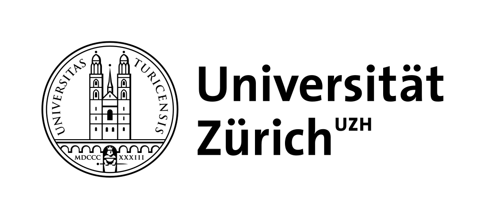
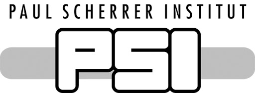
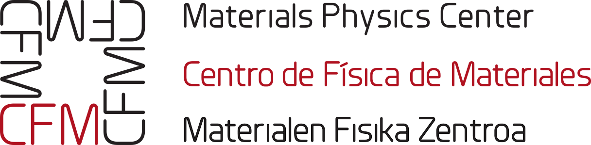
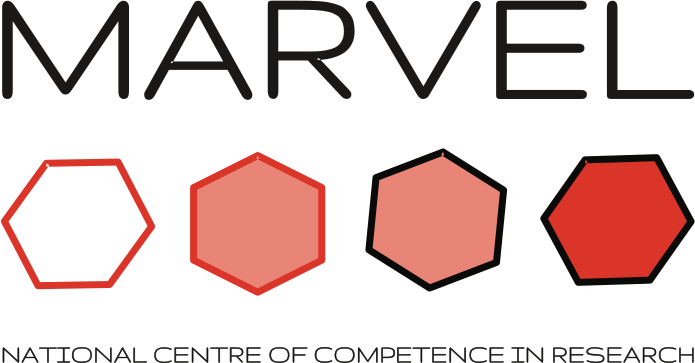
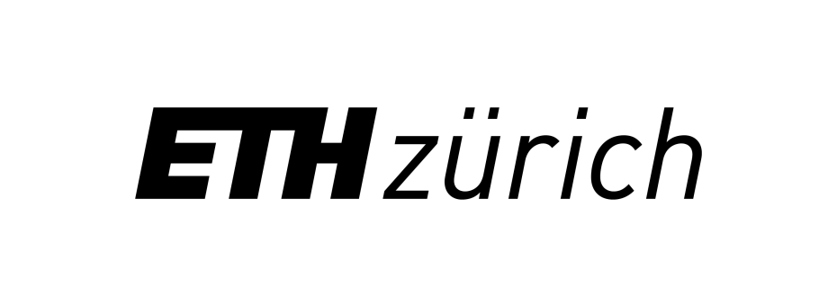

**************
Organizations
**************

Author and principle contributors to the code are affiliated or received funding from

.. image:: imag/logo-org/Ikerbasque_Logoa.jpg
   :width: 200px
   :alt: Ikerbasque
   :target: https://www.ikerbasque.net/

