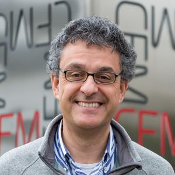

*******
People
*******

Author
==============

Stepan Tsirkin, University of Zurich

.. image:: imag/photo/stepantsirkin.jpg.jpg
   :height: 200px
   :width: 200px
   :alt: Stepan

|

Contributors
==============

.. list-table:: 
   :align: left
   :widths: 33 33 33
   :header-rows: 0

   * - Xiaoxiong Liu

       University of Zurich

       .. image:: imag/photo/Xiaoxiong_Liu.jpg.jpg
          :height: 200px
          :width: 200px
          :alt: Xiaoxiong

     - Miguel Angel Jimenez Herrera

       University of the Basque Country

       .. image:: imag/photo/Miguel_Angel_Jimenez.jpg 
          :height: 200px
          :width: 200px
          :alt: MA

     - Patrick Lannggenhager

       PSI,ETH,UZH

       .. image:: imag/photo/photo_patrick_lenggenhager_1.jpg.jpg
          :height: 200px
          :width: 200px
          :alt: Patrick

Consultant
==============
Ivo Souza, IKERBASQUE foundation

Active bug reporters:
======================

+ Rafael González, Universidad del Norte, Colombia

+ Minkyu Park (박민규), University of Ulsan, Republic of Korea

+ Kisung Kang, University of Illinois at Urbana-Champaign, USA

+ Jae-Mo Lihm, Seoul National University,  Republic of Korea